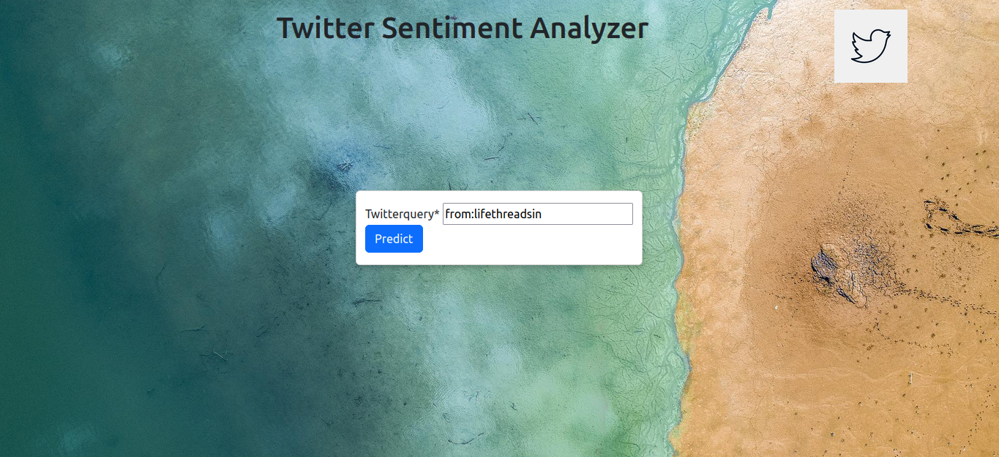
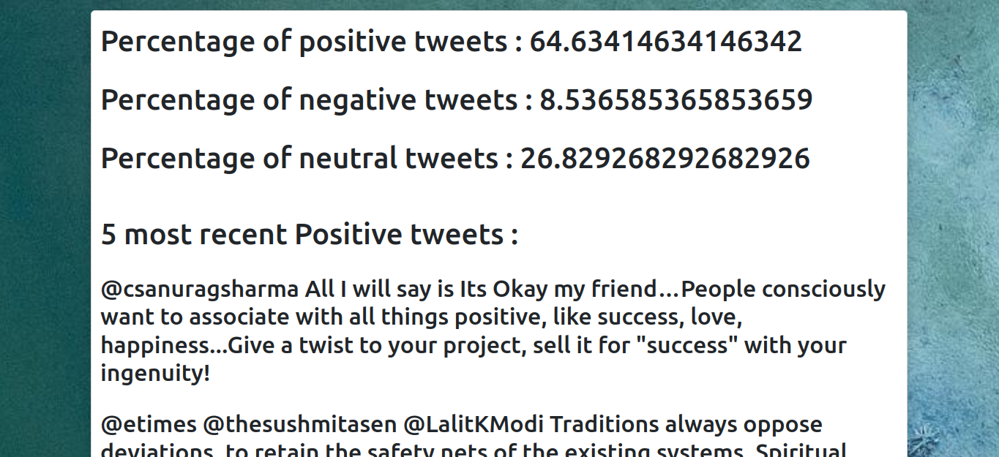

# Twitter-sentiment-analyzer-webapp

Django app that takes your query as input and fetches live data using the Twitter API to return the percentage of positive, negative, and neutral sentiment tweets along with the 5 most recent positive and negative sentiment tweets associated with that query.

Tweets can be queried by either the hashtags within the tweets or by a particular twitter handle. For querying a handle add 'from:' as a prefix to the twitter handle.

# How to run the app

### Get a Twitter developer account
You will need a twitter developer account for accessing the Twitter API v2

Link :  https://developer.twitter.com/en/apply-for-access

Once you have the account save your private tokens as you will need your bearer token for accessing the Twitter API v2

Locate mainapp/views.py

In the TwitterSent() class find the get_tweets function and enter you bearer token between "" in token = "" and save the file

Follow further instructions in the terminal
### Create a new environment
```
conda create -n djangoenv python=3.9 anaconda
```
### Activate new environment
```
conda activate djangoenv
```
### Install django
```
conda install -c anaconda django
```
### Install tweepy
Its an open-source python package that gives certain methods and classes to seamlessly access the twitter API in the python platform.
```
conda install -c conda-forge tweepy
```
### Install TextBlob
Its a library for processing text data. It provides simple functions and classes for using Natural Language Processing (NLP) for various tasks such as Noun Phrase extraction, classification, Translation, and sentiment analysis. We are concerned with the sentiment analysis part of the text blob.
```
conda install -c conda-forge textblob
```
### Run your app
cd to the one with manage.py and run
```
python manage.py runserver
```
Open your browser and go to http://localhost:8000/ you should see the app running

From here type in your query and see the results

## Working Images
### Input
Querying tweets from a twitter handle -> lifethreadsin

### Results

